# HashNow

**Right-click any file in Windows Explorer to instantly generate 70 different hashes to JSON.**

[](LICENSE)
[](https://dotnet.microsoft.com/)
[](tests/)
[](https://github.com/TheAnsarya/HashNow/releases/latest)

HashNow is a Windows file hashing utility that computes **70 hash algorithms** in a single pass and outputs results to a clean, tab-indented JSON file. It integrates directly into the Windows Explorer context menu for instant right-click hashing — no command line required.

All 70 hash algorithms are powered by [**StreamHash**](https://github.com/TheAnsarya/StreamHash) ([NuGet](https://www.nuget.org/packages/StreamHash)), a high-performance streaming hash library written entirely in native C# with SIMD acceleration. No external cryptography libraries — every algorithm is implemented from scratch with zero `unsafe` code.

## 📥 Download & Install

### Step 1: Download

**[Download HashNow v1.4.4](https://github.com/TheAnsarya/HashNow/releases/latest)** — single self-contained `.exe`, no installer needed.

Download `HashNow.exe` from the [Releases page](https://github.com/TheAnsarya/HashNow/releases/latest) and save it somewhere permanent (e.g. `C:\Tools\HashNow.exe`). The context menu entry points to wherever you put the file, so don't move it after installing.

| 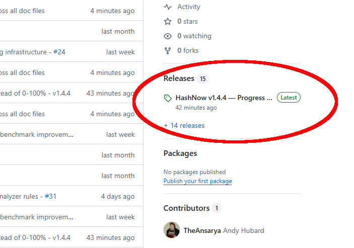 |
|---|

Your browser may warn that the file "isn't commonly downloaded." This is normal for new executables — click the keep/download option:

| 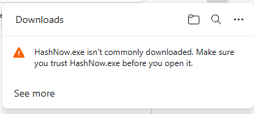 |
|---|

Click **Keep** or **Keep anyway** to save the file:

| 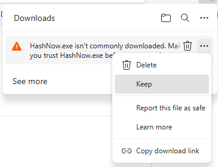 |
|---|

| 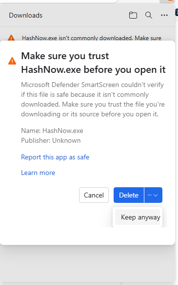 |
|---|

### Step 2: Unblock the File

Windows marks downloaded files as blocked. Before running, right-click `HashNow.exe` and select **Properties**:

| 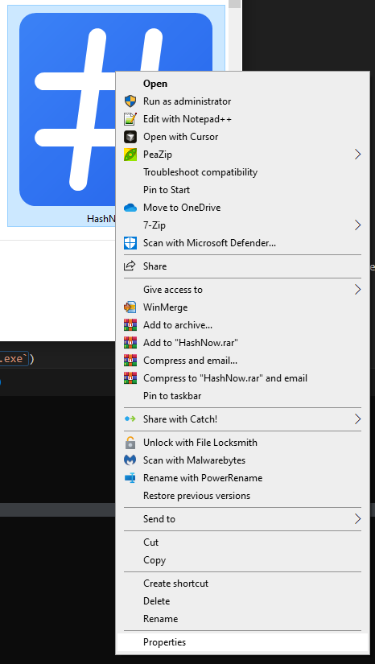 |
|---|

At the bottom of the **General** tab, check the **Unblock** checkbox and click **OK**:

| 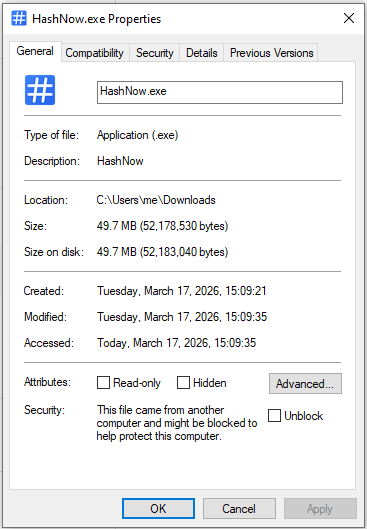 |
|---|

| 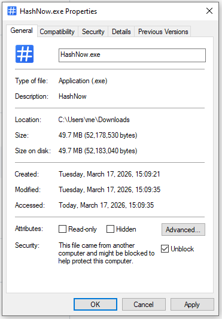 |
|---|

### Step 3: Install Context Menu

Double-click `HashNow.exe`. On first launch (with no arguments), HashNow detects it was launched directly and offers to install the Explorer context menu:

| 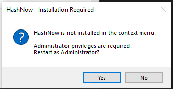 |
|---|

Click **Yes** to install. A Windows UAC prompt will appear requesting administrator privileges (required to write to the Windows registry):

| 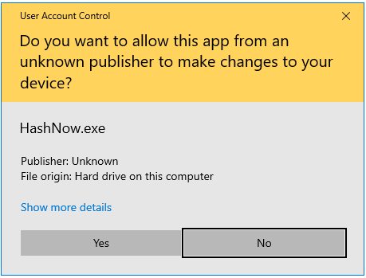 |
|---|

Click **Yes** to grant admin access. A confirmation dialog confirms the installation:

| 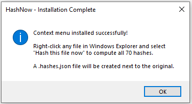 |
|---|

You're done! The context menu is now available on all file types in Explorer.

### Step 4: Hash a File

Right-click any file in Windows Explorer and select **"Hash this file now"**:

| 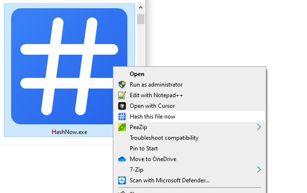 |
|---|

A progress dialog appears while hashing:

| 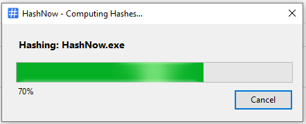 |
|---|

The dialog shows the file name, a progress bar (0–100%), percentage complete, and a **Cancel** button to abort at any time. It closes automatically when done.

### Step 5: View Results

Find `{filename}.hashes.json` in the same folder as the original file:

| 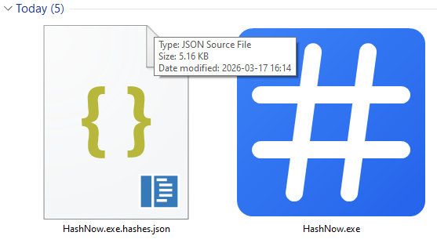 |
|---|

Open the JSON file to see all 70 hashes organized by category:

| 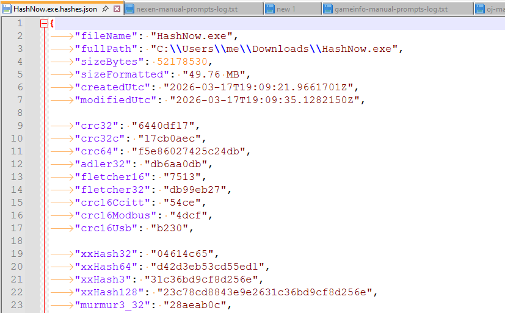 |
|---|

## ✨ Features

- **70 Algorithms** in 4 categories (checksums, fast non-crypto, cryptographic, other crypto)
- **Single Pass** — all 70 hashes computed in one file read
- **Parallel Processing** — all algorithms run concurrently
- **JSON Output** — tab-indented, organized by category with metadata
- **Progress Dialog** — shows progress bar with percentage, closes automatically
- **Cancellation** — cancel button stops hashing immediately
- **Reusable Library** — `HashNow.Core` can be used in any .NET project
- **Powered by [StreamHash](https://www.nuget.org/packages/StreamHash)** — all 70 algorithms in pure native C#
- **Public Domain** — [The Unlicense](LICENSE), free for any use

## 📋 Command-Line Usage

HashNow can also be used entirely from the command line:

```powershell
# Hash a single file
HashNow.exe myfile.zip

# Hash multiple files (each gets its own .hashes.json)
HashNow.exe file1.iso file2.zip file3.bin
```

|  |
|---|

### Management Commands

```powershell
# Install context menu (requires admin)
HashNow.exe --install

# Uninstall context menu (requires admin)
HashNow.exe --uninstall

# Check if context menu is installed and path is correct
HashNow.exe --status

# Show all available commands
HashNow.exe --help

# Show version info
HashNow.exe --version
```

|  |
|---|

| Command | Description | Requires Admin |
|---------|-------------|:--------------:|
| `--install` | Register "Hash this file now" in Explorer | Yes |
| `--uninstall` | Remove context menu entry | Yes |
| `--status` | Check if context menu is correctly installed | No |
| `--help` | Show usage information | No |
| `--version` | Show version and algorithm count | No |

The context menu entry is stored in the Windows registry under `HKEY_CLASSES_ROOT\*\shell\HashNow` and applies to all file types.

### Uninstalling

To remove the context menu and start fresh:

```powershell
# From an admin PowerShell prompt:
.\HashNow.exe --uninstall
```

After uninstalling, double-click `HashNow.exe` again to re-trigger the install flow. If you're upgrading from an older version, **uninstall first** — the old registry entry points to the old exe path and will block the new install.

## 📊 Output Format

HashNow creates `{filename}.hashes.json` next to the original file. The JSON uses **tab indentation** with **blank lines between sections** for readability:

```json
{
	"fileName": "example.zip",
	"fullPath": "C:\\Downloads\\example.zip",
	"sizeBytes": 1048576,
	"sizeFormatted": "1 MB",
	"createdUtc": "2025-02-03T10:30:00Z",
	"modifiedUtc": "2025-02-03T10:30:00Z",

	"crc32": "a1b2c3d4",
	"crc32C": "12345678",
	"crc64": "0123456789abcdef",
	...

	"md5": "d41d8cd98f00b204e9800998ecf8427e",
	"sha256": "e3b0c44298fc1c149afbf4c8996fb92427ae41e4649b934ca495991b7852b855",
	"blake3": "af1349b9f5f9a1a6a0404dea36dcc949...",
	...

	"hashedAtUtc": "2025-02-05T10:30:15Z",
	"durationMs": 1003,
	"generatedBy": "HashNow v1.4.4",
	"algorithmCount": 70
}
```

**Output details:**

- All hash values in **lowercase hexadecimal**
- File metadata at top (name, path, size, timestamps)
- Hashes organized by category: checksums → fast → crypto → other
- Timing and version metadata at bottom

## 🔐 Hash Algorithms (70)

| Category | Count | Algorithms |
|----------|:-----:|------------|
| **Checksums** | 9 | CRC32, CRC32C, CRC64, CRC16 (CCITT/MODBUS/USB), Adler32, Fletcher16, Fletcher32 |
| **Fast Non-Crypto** | 21 | xxHash (32/64/3/128), MurmurHash3 (32/128), CityHash (64/128), FarmHash64, SpookyV2, SipHash, HighwayHash64, MetroHash (64/128), Wyhash64, FNV-1a (32/64), DJB2, DJB2a, SDBM, LoseLose |
| **Cryptographic** | 26 | MD2, MD4, MD5, SHA-0/1/224/256/384/512, SHA-512/224, SHA-512/256, SHA3 (224/256/384/512), Keccak (256/512), BLAKE (256/512), BLAKE2b/2s, BLAKE3, RIPEMD (128/160/256/320) |
| **Other Crypto** | 14 | Whirlpool, Tiger, GOST, Streebog (256/512), Skein (256/512/1024), Groestl (256/512), JH (256/512), KangarooTwelve, SM3 |

All algorithms are provided by [StreamHash](https://github.com/TheAnsarya/StreamHash) ([NuGet](https://www.nuget.org/packages/StreamHash)). For the full per-algorithm list, see the [StreamHash README](https://github.com/TheAnsarya/StreamHash#readme).

## 📚 Using the Core Library

The `HashNow.Core` library can be referenced in any .NET 10 project:

```csharp
using HashNow.Core;

// Hash a file and get all 70 hashes
var result = FileHasher.HashFile("myfile.zip");
Console.WriteLine($"SHA256: {result.Sha256}");
Console.WriteLine($"BLAKE3: {result.Blake3}");
Console.WriteLine($"CRC32:  {result.Crc32}");

// Save results to JSON
FileHasher.SaveResult(result, "myfile.zip.hashes.json");

// Async with progress reporting
var progress = new Progress<double>(p => Console.Write($"\r{p:P0}"));
var result = await FileHasher.HashFileAsync("largefile.iso", progress);
```

## 🏗️ Building from Source

### Prerequisites

- [.NET 10 SDK](https://dotnet.microsoft.com/download/dotnet/10.0)
- Windows (for context menu features and WinForms progress dialog)

### Build & Test

```bash
git clone https://github.com/TheAnsarya/HashNow.git
cd HashNow
dotnet build
dotnet test
```

### Publish Self-Contained Executable

```bash
dotnet publish src/HashNow.Cli -c Release -r win-x64 --self-contained true -o publish
```

This produces a single `HashNow.exe` (~50 MB) that includes the .NET runtime and all dependencies — no installation required.

## ⚡ Performance

All 70 hashes are computed in a **single file read** with parallel processing:

- **1 MB buffer** with ArrayPool memory management
- **Single pass** — file is read once, all algorithms fed concurrently
- **Powered by [StreamHash](https://www.nuget.org/packages/StreamHash)** — native C# with SIMD acceleration (AVX2, SSE4.2, AES-NI)

For detailed benchmark results, see [Performance](docs/PERFORMANCE.md). For per-algorithm data, see [StreamHash Benchmarks](https://github.com/TheAnsarya/StreamHash/blob/main/docs/benchmarks.md).

## 📖 Documentation

- [Changelog](CHANGELOG.md) — version history and release notes
- [Performance](docs/PERFORMANCE.md) — benchmarks, architecture, and optimization details
- [Manual Testing Guide](docs/MANUAL_TESTING.md) — step-by-step testing procedures
- [StreamHash](https://github.com/TheAnsarya/StreamHash) — the hash algorithm library powering HashNow ([NuGet](https://www.nuget.org/packages/StreamHash) · [Benchmarks](https://github.com/TheAnsarya/StreamHash/blob/main/docs/benchmarks.md))

## 📄 License

[The Unlicense](LICENSE) — Public domain, free for any use.
