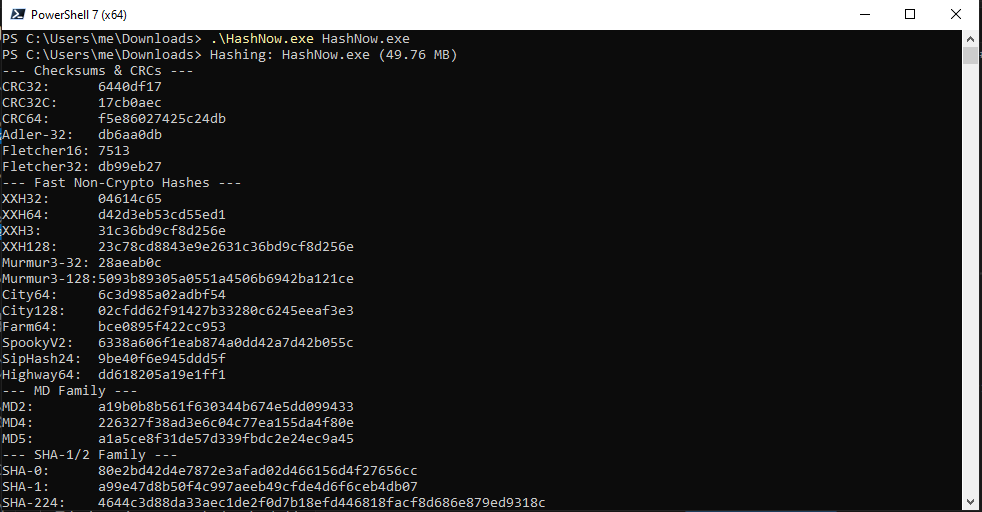
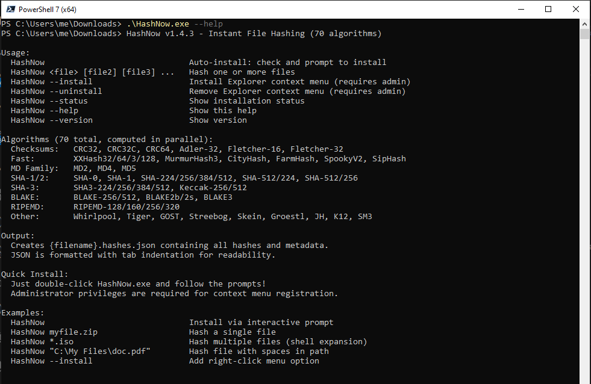

# HashNow

**Right-click any file to instantly generate 70 different hashes to JSON — on Windows, Linux, and macOS.**

[](LICENSE)
[](https://dotnet.microsoft.com/)
[](https://github.com/TheAnsarya/HashNow/actions/workflows/build.yml)
[](tests/)
[](https://github.com/TheAnsarya/HashNow/releases/latest)

HashNow is a cross-platform file hashing utility that computes **70 hash algorithms** in a single pass and outputs results to a clean, tab-indented JSON file. It integrates directly into your file manager's context menu for instant right-click hashing — no command line required.

| Platform | File Manager Integration |
|----------|--------------------------|
| **Windows** | Explorer context menu (registry-based) |
| **Linux** | Nautilus, Nemo, Dolphin, Thunar scripts/actions |
| **macOS** | Finder Quick Actions (Automator workflow) |

All 70 hash algorithms are powered by [**StreamHash**](https://github.com/TheAnsarya/StreamHash) ([NuGet](https://www.nuget.org/packages/StreamHash)), a high-performance streaming hash library written entirely in native C# with SIMD acceleration. No external cryptography libraries — every algorithm is implemented from scratch with zero `unsafe` code.

## 📥 Download & Install

Download the latest release for your platform from the [Releases page](https://github.com/TheAnsarya/HashNow/releases/latest):

| Platform | Download | Install Guide |
|----------|----------|---------------|
| **Windows x64** | `HashNow-Windows-x64-v1.5.0.exe` | [Windows Installation Guide](docs/install-windows.md) |
| **Linux x64** | `HashNow-Linux-x64-v1.5.0.tar.gz` | [Linux Installation Guide](docs/install-linux.md) |
| **Linux ARM64** | `HashNow-Linux-ARM64-v1.5.0.tar.gz` | [Linux Installation Guide](docs/install-linux.md) |
| **macOS ARM64** | `HashNow-macOS-ARM64-v1.5.0.tar.gz` | [macOS Installation Guide](docs/install-macos.md) |

Each download is a single self-contained binary (~50 MB) that includes the .NET runtime and all dependencies — no installation required. See the platform-specific installation guides for detailed setup instructions with screenshots.

## ✨ Features

- **70 Algorithms** in 4 categories (checksums, fast non-crypto, cryptographic, other crypto)
- **Cross-Platform** — Windows, Linux, and macOS with native file manager integration
- **Single Pass** — all 70 hashes computed in one file read
- **Parallel Processing** — all algorithms run concurrently
- **JSON Output** — tab-indented, organized by category with metadata
- **Progress Reporting** — GUI progress dialog (Windows) or console progress bar (Linux/macOS)
- **Cancellation** — cancel button/Ctrl+C stops hashing immediately
- **Reusable Library** — `HashNow.Core` can be used in any .NET project
- **Powered by [StreamHash](https://www.nuget.org/packages/StreamHash)** — all 70 algorithms in pure native C#
- **Public Domain** — [The Unlicense](LICENSE), free for any use

## 📋 Command-Line Usage

HashNow can also be used entirely from the command line:

```powershell
# Hash a single file
HashNow myfile.zip

# Hash multiple files (each gets its own .hashes.json)
HashNow file1.iso file2.zip file3.bin
```

|  |
|---|

### Management Commands

```powershell
# Install context menu (requires admin on Windows)
HashNow --install

# Uninstall context menu
HashNow --uninstall

# Check if context menu is installed and path is correct
HashNow --status

# Show all available commands
HashNow --help

# Show version info
HashNow --version
```

|  |
|---|

| Command | Description | Requires Admin |
|---------|-------------|:--------------:|
| `--install` | Register context menu in file manager | Windows only |
| `--uninstall` | Remove context menu entry | Windows only |
| `--status` | Check if context menu is correctly installed | No |
| `--help` | Show usage information | No |
| `--version` | Show version and algorithm count | No |

The context menu integration is platform-specific:

- **Windows**: Registry entry at `HKEY_CLASSES_ROOT\*\shell\HashNow` (requires admin)
- **Linux**: Scripts/actions in `~/.local/share/` for Nautilus, Nemo, Dolphin, Thunar
- **macOS**: Automator workflow at `~/Library/Services/`

### Uninstalling

To remove the context menu:

```powershell
# Remove context menu integration
HashNow --uninstall
```

On Windows, run from an admin prompt. On Linux/macOS, no elevation is needed.

## 📊 Output Format

HashNow creates `{filename}.hashes.json` next to the original file. The JSON uses **tab indentation** with **blank lines between sections** for readability:

```json
{
	"fileName": "example.zip",
	"fullPath": "C:\\Downloads\\example.zip",
	"sizeBytes": 1048576,
	"sizeFormatted": "1 MB",
	"createdUtc": "2025-02-03T10:30:00Z",
	"modifiedUtc": "2025-02-03T10:30:00Z",

	"crc32": "a1b2c3d4",
	"crc32C": "12345678",
	"crc64": "0123456789abcdef",
	...

	"md5": "d41d8cd98f00b204e9800998ecf8427e",
	"sha256": "e3b0c44298fc1c149afbf4c8996fb92427ae41e4649b934ca495991b7852b855",
	"blake3": "af1349b9f5f9a1a6a0404dea36dcc949...",
	...

	"hashedAtUtc": "2025-02-05T10:30:15Z",
	"durationMs": 1003,
	"generatedBy": "HashNow v1.5.0",
	"algorithmCount": 70
}
```

**Output details:**

- All hash values in **lowercase hexadecimal**
- File metadata at top (name, path, size, timestamps)
- Hashes organized by category: checksums → fast → crypto → other
- Timing and version metadata at bottom

## 🔐 Hash Algorithms (70)

| Category | Count | Algorithms |
|----------|:-----:|------------|
| **Checksums** | 9 | CRC32, CRC32C, CRC64, CRC16 (CCITT/MODBUS/USB), Adler32, Fletcher16, Fletcher32 |
| **Fast Non-Crypto** | 21 | xxHash (32/64/3/128), MurmurHash3 (32/128), CityHash (64/128), FarmHash64, SpookyV2, SipHash, HighwayHash64, MetroHash (64/128), Wyhash64, FNV-1a (32/64), DJB2, DJB2a, SDBM, LoseLose |
| **Cryptographic** | 26 | MD2, MD4, MD5, SHA-0/1/224/256/384/512, SHA-512/224, SHA-512/256, SHA3 (224/256/384/512), Keccak (256/512), BLAKE (256/512), BLAKE2b/2s, BLAKE3, RIPEMD (128/160/256/320) |
| **Other Crypto** | 14 | Whirlpool, Tiger, GOST, Streebog (256/512), Skein (256/512/1024), Groestl (256/512), JH (256/512), KangarooTwelve, SM3 |

All algorithms are provided by [StreamHash](https://github.com/TheAnsarya/StreamHash) ([NuGet](https://www.nuget.org/packages/StreamHash)). For the full per-algorithm list, see the [StreamHash README](https://github.com/TheAnsarya/StreamHash#readme).

## 📚 Using the Core Library

The `HashNow.Core` library can be referenced in any .NET 10 project:

```csharp
using HashNow.Core;

// Hash a file and get all 70 hashes
var result = FileHasher.HashFile("myfile.zip");
Console.WriteLine($"SHA256: {result.Sha256}");
Console.WriteLine($"BLAKE3: {result.Blake3}");
Console.WriteLine($"CRC32:  {result.Crc32}");

// Save results to JSON
FileHasher.SaveResult(result, "myfile.zip.hashes.json");

// Async with progress reporting
var progress = new Progress<double>(p => Console.Write($"\r{p:P0}"));
var result = await FileHasher.HashFileAsync("largefile.iso", progress);
```

## 🏗️ Building from Source

### Prerequisites

- [.NET 10 SDK](https://dotnet.microsoft.com/download/dotnet/10.0)

### Build & Test

```bash
git clone https://github.com/TheAnsarya/HashNow.git
cd HashNow
dotnet build
dotnet test
```

### Publish Self-Contained Executable

```bash
# Windows
dotnet publish src/HashNow.Cli -c Release -f net10.0-windows -r win-x64 -o publish/win-x64

# Linux x64
dotnet publish src/HashNow.Cli -c Release -f net10.0 -r linux-x64 -o publish/linux-x64

# Linux ARM64
dotnet publish src/HashNow.Cli -c Release -f net10.0 -r linux-arm64 -o publish/linux-arm64

# macOS ARM64
dotnet publish src/HashNow.Cli -c Release -f net10.0 -r osx-arm64 -o publish/osx-arm64
```

Each produces a single self-contained binary (~50 MB) that includes the .NET runtime and all dependencies — no installation required.

## ⚡ Performance

All 70 hashes are computed in a **single file read** with parallel processing:

- **1 MB buffer** with ArrayPool memory management
- **Single pass** — file is read once, all algorithms fed concurrently
- **Powered by [StreamHash](https://www.nuget.org/packages/StreamHash)** — native C# with SIMD acceleration (AVX2, SSE4.2, AES-NI)

For detailed benchmark results, see [Performance](docs/PERFORMANCE.md). For per-algorithm data, see [StreamHash Benchmarks](https://github.com/TheAnsarya/StreamHash/blob/main/docs/benchmarks.md).

## 📖 Documentation

- [Windows Installation Guide](docs/install-windows.md) — step-by-step with screenshots
- [Linux Installation Guide](docs/install-linux.md) — setup for Nautilus, Nemo, Dolphin, Thunar
- [macOS Installation Guide](docs/install-macos.md) — Finder Quick Action setup
- [Changelog](CHANGELOG.md) — version history and release notes
- [Performance](docs/PERFORMANCE.md) — benchmarks, architecture, and optimization details
- [Manual Testing Guide](docs/MANUAL_TESTING.md) — step-by-step testing procedures
- [StreamHash](https://github.com/TheAnsarya/StreamHash) — the hash algorithm library powering HashNow ([NuGet](https://www.nuget.org/packages/StreamHash) · [Benchmarks](https://github.com/TheAnsarya/StreamHash/blob/main/docs/benchmarks.md))

## 📄 License

[The Unlicense](LICENSE) — Public domain, free for any use.
